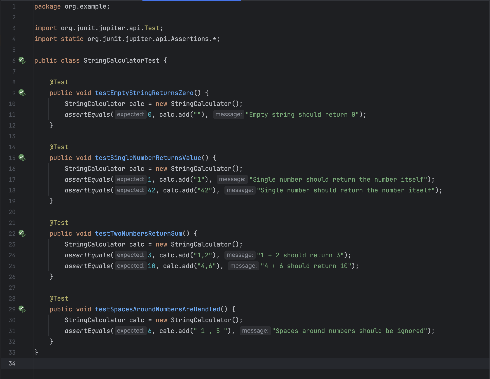
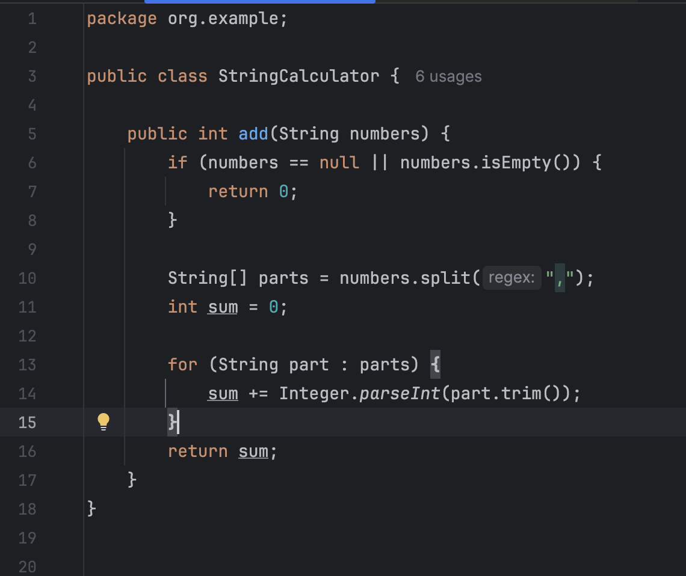
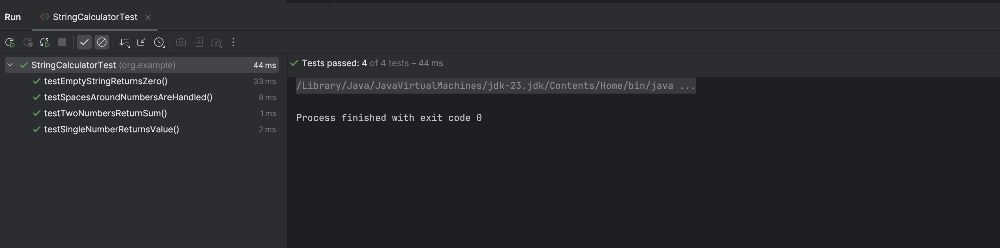

# Java Maven Project - String Calculator TDD Kata

This is a sample Java Maven project built using IntelliJ IDEA.

# 🚀 Steps
# Step1

#### Create a simple String calculator with a method signature like this:
#### int add(string numbers)
#### Input: a string of comma-separated numbers
#### Output: an integer, sum of the numbers

## 🔧 Technologies

- Java 23
- JUnit

## 🖼️ Screenshots

### String Calculator Function

### Test Cases with code

