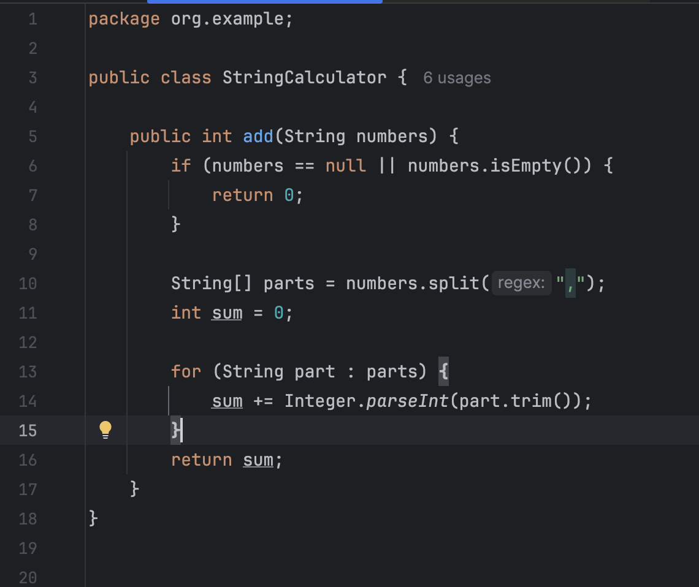
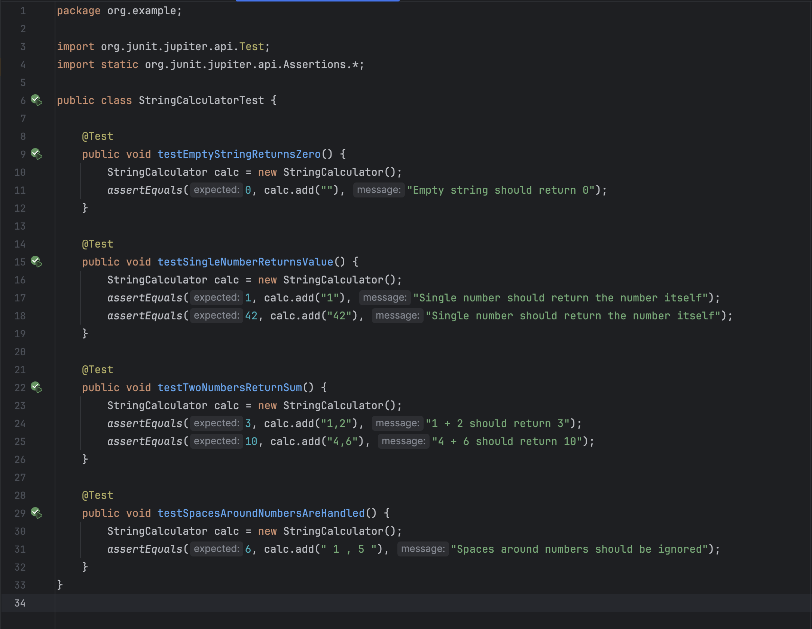
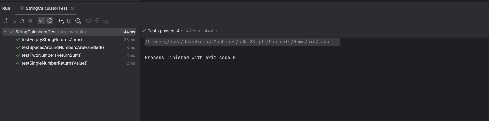
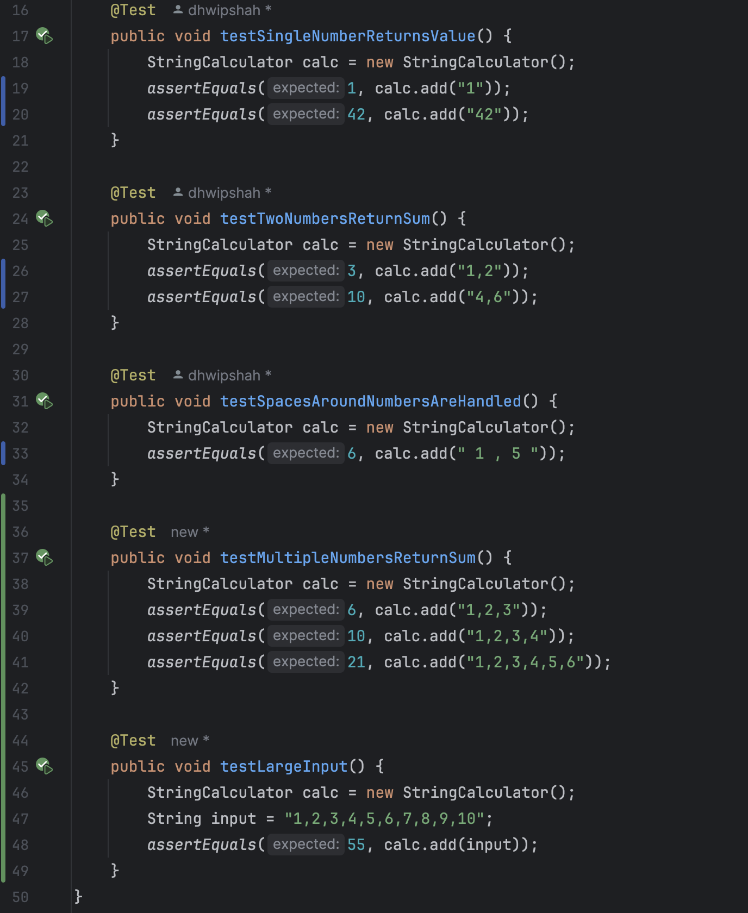
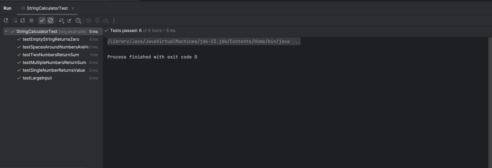
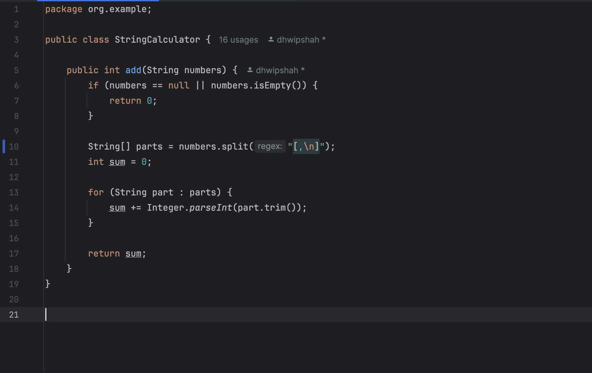
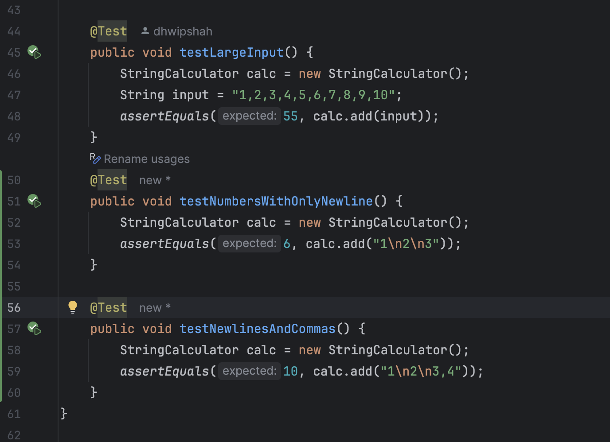
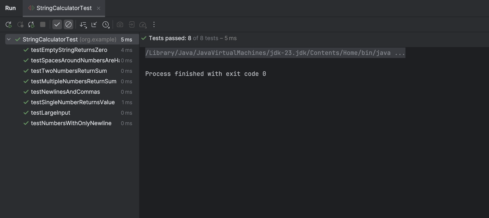

# Java Maven Project - String Calculator TDD Kata

Greeting,
I am Dhwip Shah(22ITUOS151) a student of Dharmsinh Desai University.
I have created this repository to submit my assessment to Incubtye.
It follows step by step implementation of assessment.

# 🔧 Technologies

- Java 23
- JUnit

# 🚀 Steps
# Step1

#### Created a simple String calculator with a method signature like this:
#### int add(string numbers)
#### Input: a string of comma-separated numbers
#### Output: an integer, sum of the numbers

## 🖼️ Screenshots

### String Calculator Function

### Test Cases with code

# Step2

#### Allowed the add method to handle any amount of numbers.

## 🖼️ Screenshots

### String Calculator Function

### Test Cases with code

# Step3

#### Allowed the add method to handle new lines between numbers (instead of commas). ("1\n2,3" should return 6)

## 🖼️ Screenshots

### String Calculator Function

### Test Cases with code

