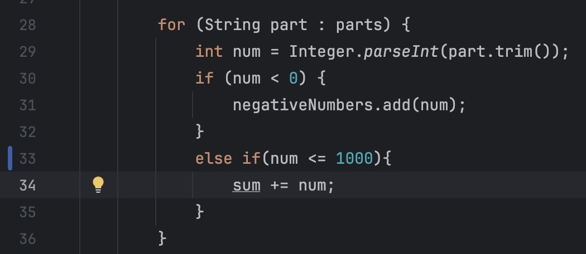
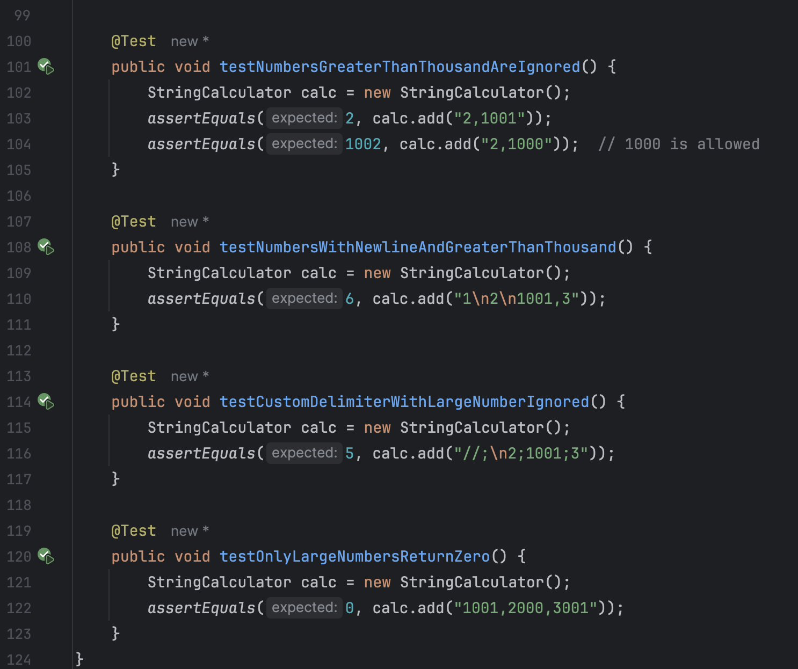
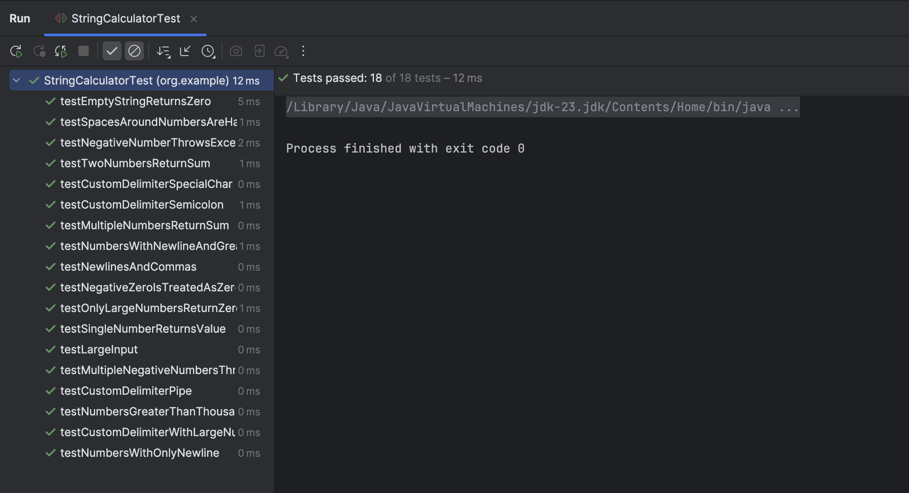
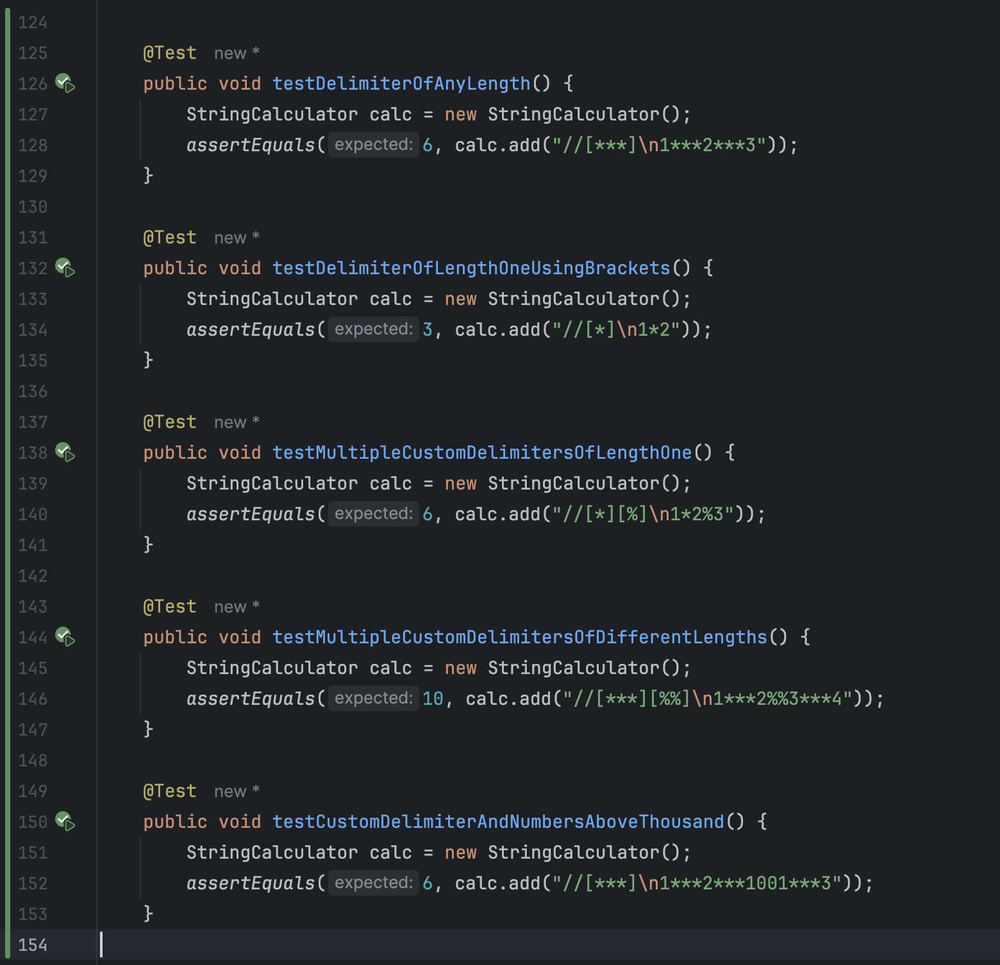
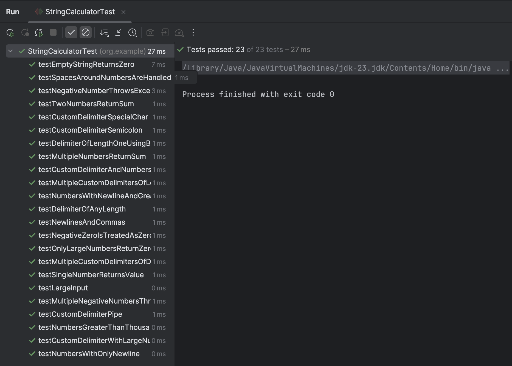
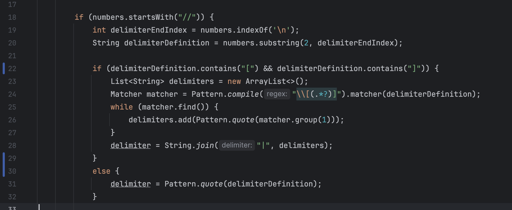
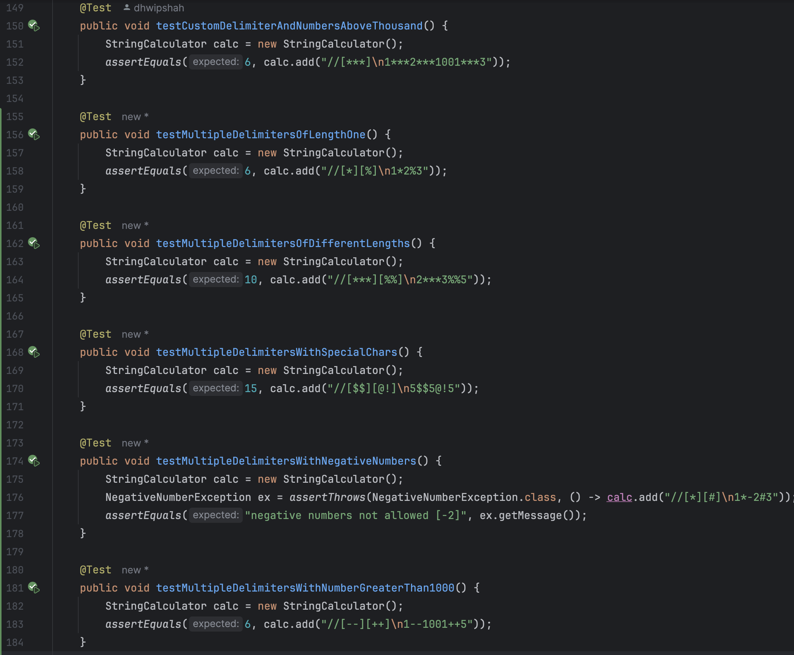
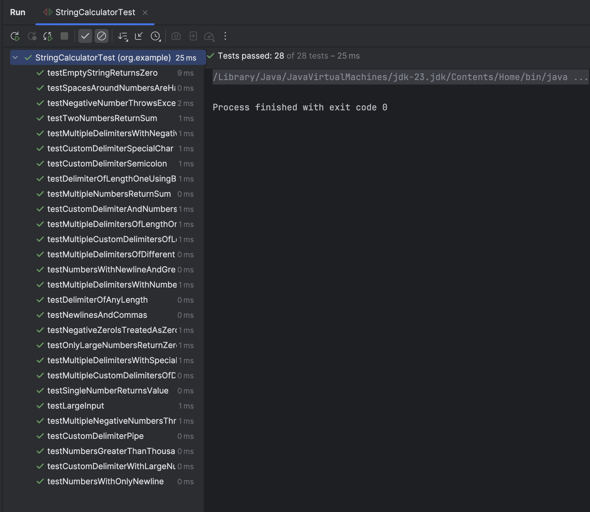
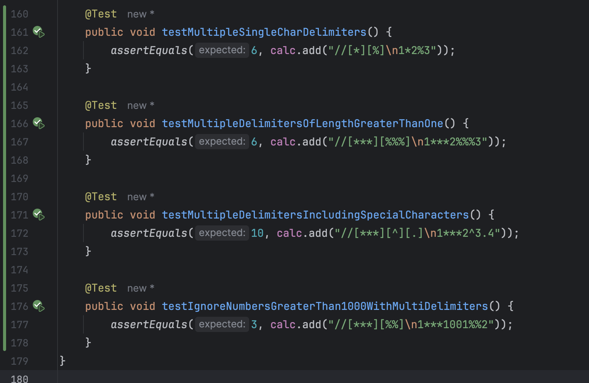
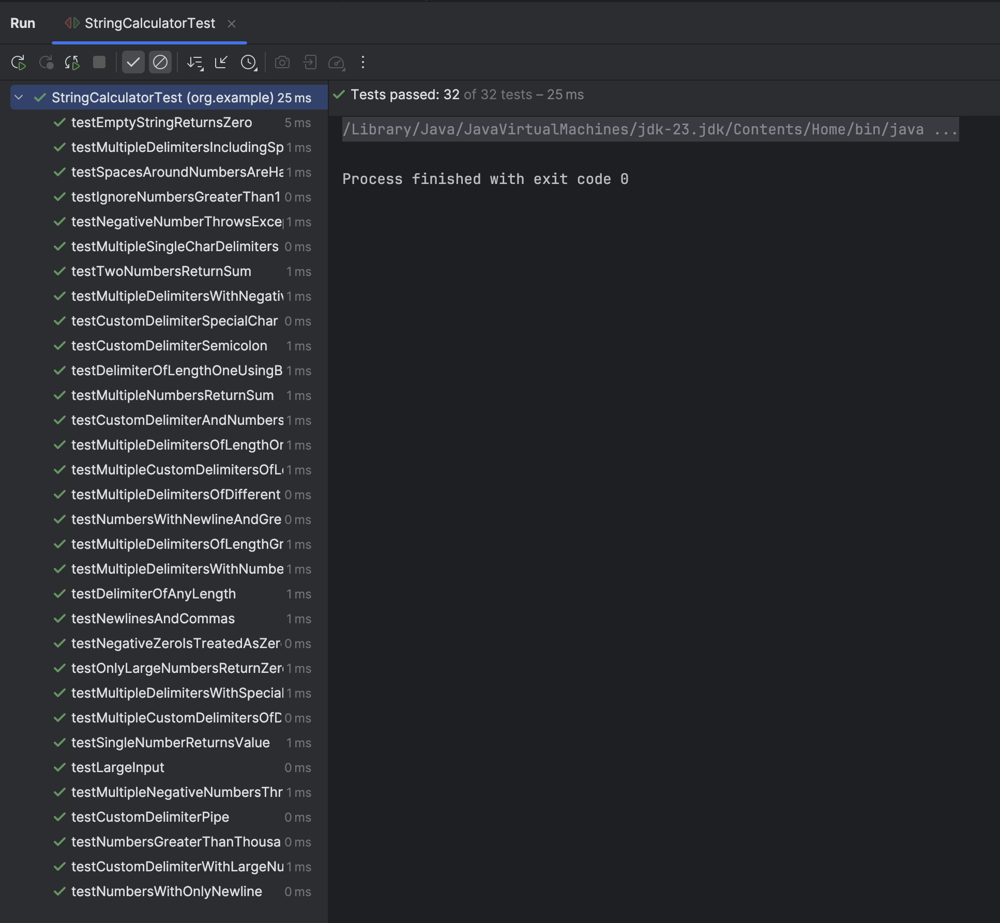

# Java Maven Project - String Calculator TDD Kata

Greeting,
I am Dhwip Shah(22ITUOS151) a student of Dharmsinh Desai University.
I have created this repository to submit my assessment to Incubtye.
It follows step by step implementation of assessment.

# 🔧 Technologies

- Java 23
- JUnit

# 🚀 Steps
# Step1

#### Created a simple String calculator with a method signature like this:
#### int add(string numbers)
#### Input: a string of comma-separated numbers
#### Output: an integer, sum of the numbers

## 🖼️ Screenshots

### String Calculator Function

### Test Cases with code

# Step2

#### Allowed the add method to handle any amount of numbers.

## 🖼️ Screenshots

### String Calculator Function

### Test Cases with code

# Step3

#### Allowed the add method to handle new lines between numbers (instead of commas). ("1\n2,3" should return 6)

## 🖼️ Screenshots

### String Calculator Function

### Test Cases with code

# Step4

#### Support different delimiters:

- To change the delimiter, the beginning of the string will contain a separate line that looks like this:"//[delimiter]\n[numbers…]". 
- For example, "//;\n1;2" where the delimiter is ";" should return 3.

## 🖼️ Screenshots

### String Calculator Function

### Test Cases with code

# Step5

#### Calling add with a negative number will throw an exception: "negative numbers not allowed <negative_number>".

- If there are multiple negative numbers, show all of them in the exception message, separated by commas.

## 🖼️ Screenshots

### String Calculator Function

### NegativeNumberException Class

### Test Cases with code

# Step6

#### Numbers bigger than 1000 are ignored 
- For Example, adding 2 + 1001 + 3 = 5

## 🖼️ Screenshots

### String Calculator Function

#### Updation only in for loop for condition that num > 1000 must be ignored

### Test Cases with code

# Step7

#### Delimiters can be of any length with the following format: “//[delimiter]\n” 
- for example: “//[***]\n1***2***3” should return 6

## 🖼️ Screenshots

### String Calculator Function

### Test Cases with code

# Step8

#### Allow multiple delimiters like this: “//[delim1][delim2]\n” 
- for example “//[*][%]\n1*2%3” should return 6.

## 🖼️ Screenshots

### String Calculator Function

### Test Cases with code

# Step9

#### Allowed multiple delimiters with length longer than one char

## 🖼️ Screenshots

### String Calculator Function

### Test Cases with code

